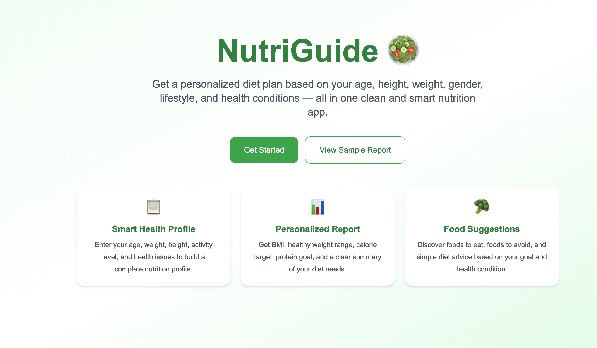
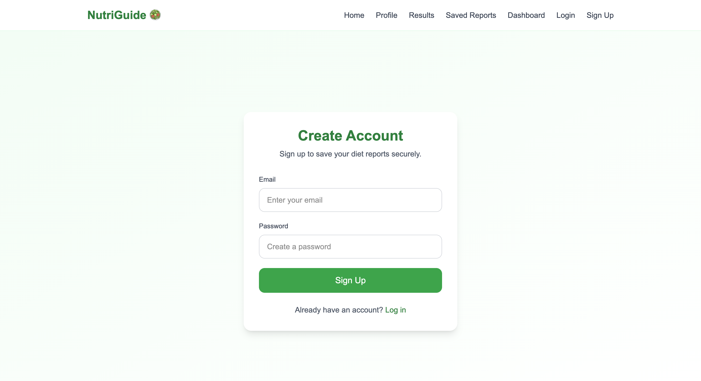
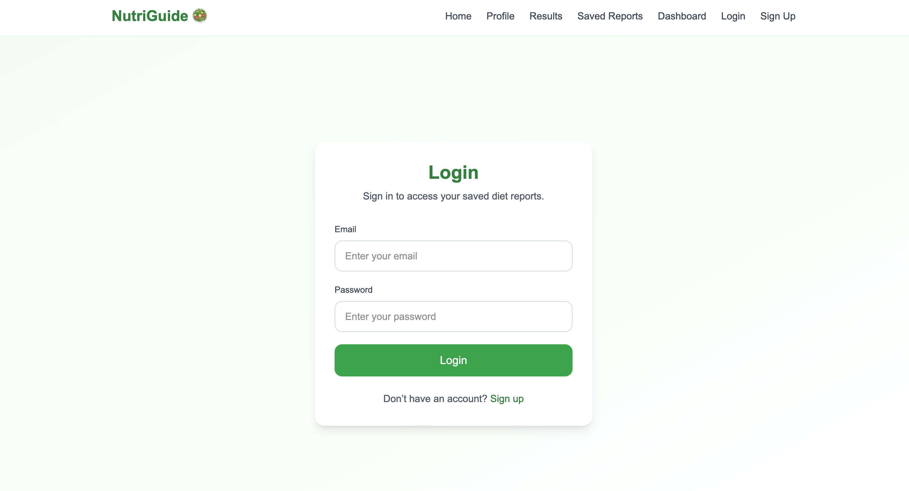
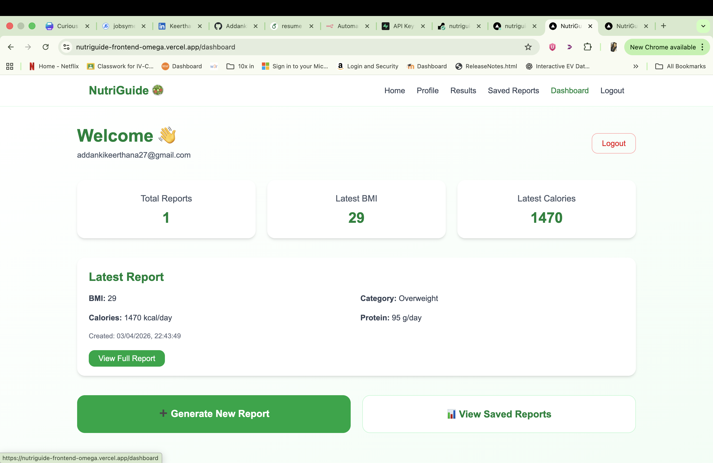

# 🥗 NutriGuide – Full Stack Diet Recommendation App

NutriGuide is a full stack health-tech web application that generates personalized diet plans based on user health profiles. It allows users to sign up, log in, generate diet reports, and securely store and manage their report history.

---

## 🌐 Live Demo

- 🚀 Frontend: https://nutriguide-frontend-omega.vercel.app  
- ⚙️ Backend API: https://nutriguide-backend-y2az.onrender.com  
- 📘 API Docs: https://nutriguide-backend-y2az.onrender.com/docs  

---

## ✨ Features

- 🔐 User Authentication (Signup/Login/Logout)
- 🛡️ Protected Routes (only logged-in users)
- 🧠 Personalized Diet Report Generation
- 📊 BMI, Calorie, Protein, Water & Steps Calculation
- 🍽️ One-Day Sample Meal Plan
- ❤️ Health Condition-Based Recommendations
- 💾 Save Reports to Database
- 📂 View Saved Reports History
- 🔍 Detailed Report View
- ❌ Delete Reports
- 📊 Dashboard with Latest Report Summary

---

## Screenshots

### Home Page


### Signup


### Login


### Dashboard


### Profile Form


### Diet Report


### Saved Reports


### Report Details

---

## 🏗️ Architecture
=======
# NutriGuide 🥗

NutriGuide is a full-stack diet recommendation web application that helps users generate personalized diet reports based on age, height, weight, gender, activity level, food preference, and health conditions.

It includes authentication, protected pages, backend-driven report generation, saved reports history, and a user dashboard.

---

## Live Demo

- **Frontend:** https://nutriguide-frontend-omega.vercel.app
- **Backend API:** https://nutriguide-backend-y2az.onrender.com
- **API Docs:** https://nutriguide-backend-y2az.onrender.com/docs

---

## Features

- User signup, login, and logout with Supabase Auth
- Protected pages for authenticated users
- Personalized diet report generation
- BMI and BMI category calculation
- Ideal weight range estimation
- Daily calorie target
- Protein goal
- Water intake target
- Daily steps target
- Foods to eat and foods to avoid
- Personalized health advice
- One-day sample meal plan
- Save generated reports to Supabase
- View saved reports history
- View detailed report pages
- Delete saved reports
- Dashboard with latest report summary

---

## Tech Stack

### Frontend
- Next.js
- TypeScript
- Tailwind CSS
- Vercel

### Backend
- FastAPI
- Python
- Uvicorn
- Render

### Database & Auth
- Supabase
- PostgreSQL
- Supabase Auth

---

## Project Structure

```text
diet-app/
├── frontend/        # Next.js frontend
├── backend/         # FastAPI backend
└── README.md